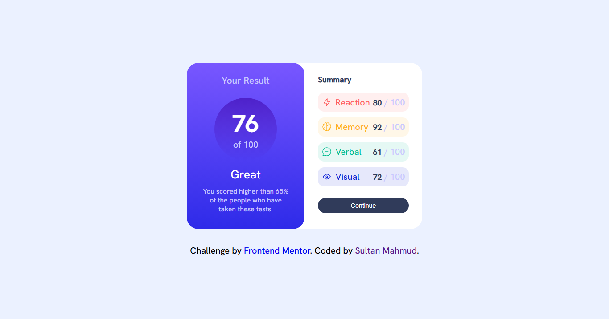
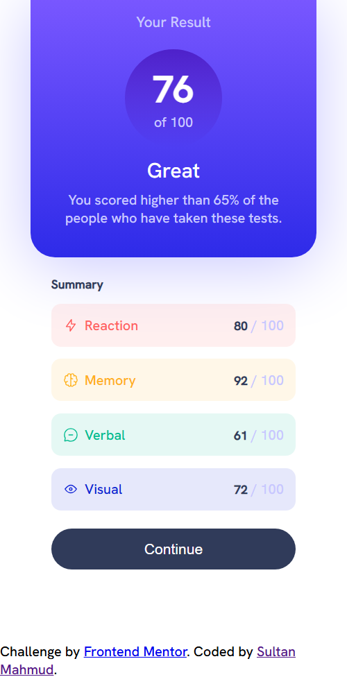
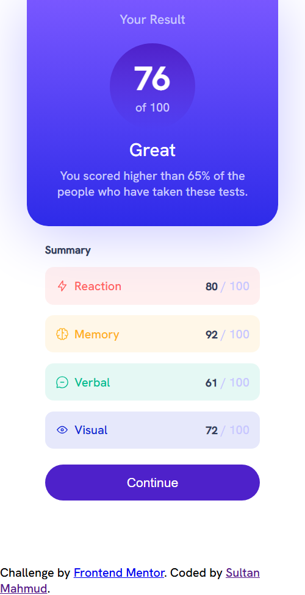

# Frontend Mentor - Results summary component solution

This is a solution to the [Results summary component challenge on Frontend Mentor](https://www.frontendmentor.io/challenges/results-summary-component-CE_K6s0maV). Frontend Mentor challenges help you improve your coding skills by building realistic projects. 

## Table of contents

- [Overview](#overview)
  - [Screenshot](#screenshot)
  - [Links](#links)
- [My process](#my-process)
  - [Built with](#built-with)
  - [What I learned](#what-i-learned)
- [Author](#author)

## Overview
Simple result summary component app for checking students results based on theri marks. 

### Screenshot

### Desktop Preview


### Mobile Preview


### Active Preview


### Links
- Live Site URL: [Click Here](https://result-summary-component-ten-rust.vercel.app/)

## My process

### Built with

- Semantic HTML5 markup
- CSS custom properties
- Flexbox
- Mobile-first workflow

### What I learned
While this project I learned how to use json file for dynamic contents

```js
/*
===============================
Summary stats dynamic function
===============================
*/

const summaryStats = () => {
    const statsContainer = document.querySelector(".summary-stat_container");
    statsContainer.innerHTML = data.map((stat) => {
        return `<div class="summary-card_stat ${stat.className}">
        <div>
          
          <span>${stat.category}</span>
        </div>
        <div>
          <span>${stat.score}</span>
          <span>/ 100</span>
        </div>
       </div>`;

    }).join("");
}

summaryStats();

```

## Author

- Facebook - [Sultan Mahmud](https://web.facebook.com/sultanmahmud.dev/)
- Frontend Mentor - [@developer-sultan](https://www.frontendmentor.io/profile/developer-sultan)
- Twitter - [@sultanmahmud404](https://x.com/sultanmahmud404)
